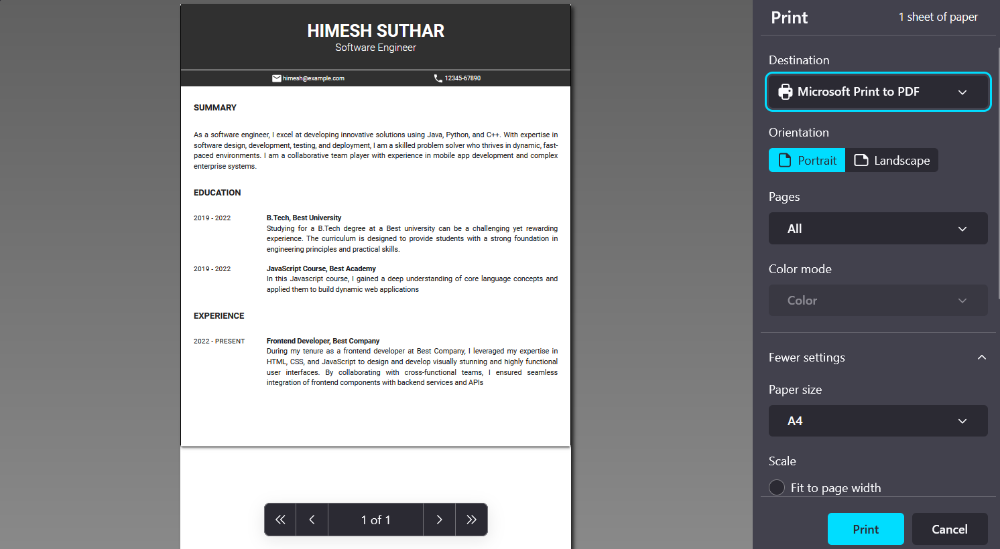

# CV GENERATOR

This project is a web application that enables users to create and generate professional-looking CVs with ease. Built with React and Material-UI, the application offers a modern and user-friendly interface with real-time previews of the CV as users fill in the details.

## Demo

[Live Preivew](https://cv-generator-himesh9512.netlify.app)


## Screenshots




## Run Locally


step 1: Clone the project

```bash
  git clone https://https://github.com/Himesh9512/CV-generator.git
```

step 2: Go to the project directory

```bash
  cd CV-generator
```

step 3: Install dependencies

```bash
  npm install
```

step 4: Start the server

```bash
  npm run dev
```
## Tech Stack

- ReactJS (JavaScript framwork)
- MaterialUI (CSS framwork)
- Netlify (web hosting) 


## Packages

- uuid: to generate random id
- react-to-print: print react component  
